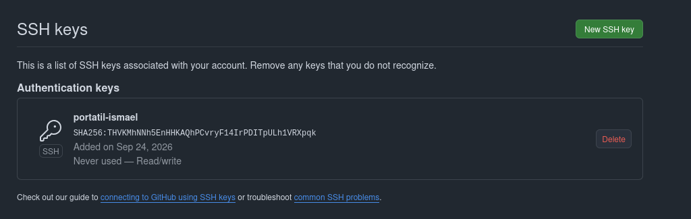
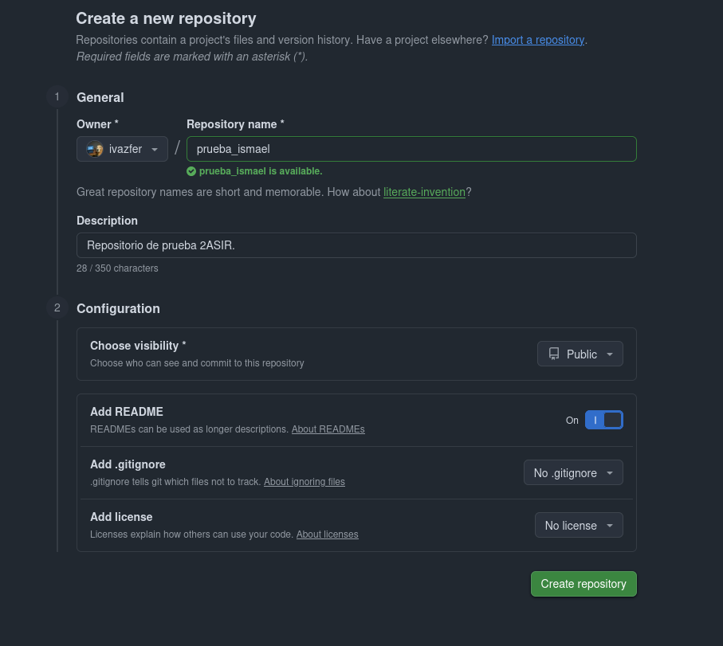
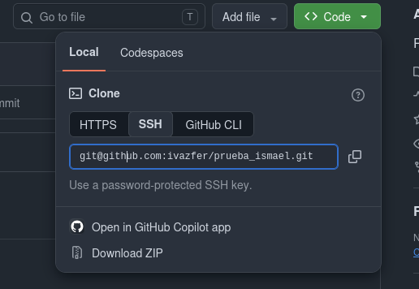
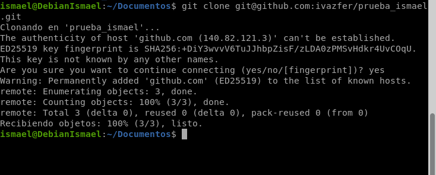
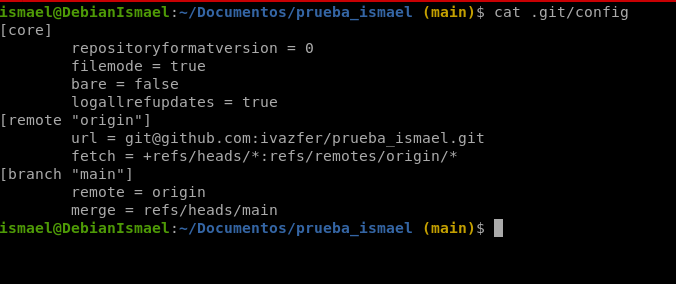
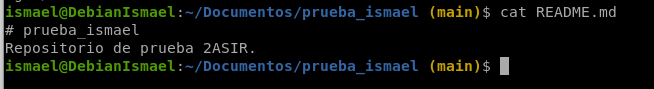
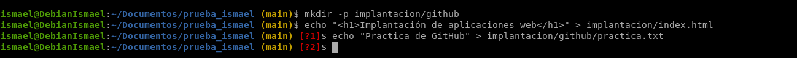
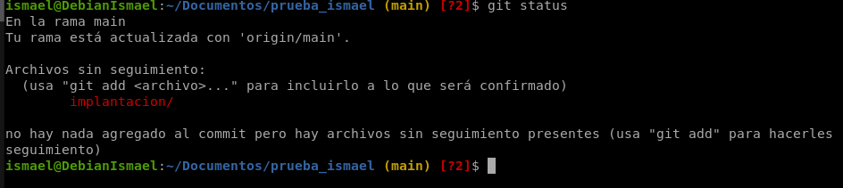
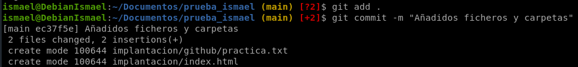
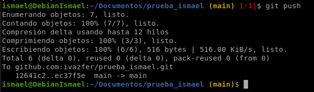

* TOC
{:toc}

## 1. Configuración de GitHub

Crea una cuenta en GitHub. La forma de acceder a los repositorios remotos de GitHub va a ser por SSH, por lo tanto debes copiar tu clave pública RSA a GitHub. Para ello, copia el contenido de tu fichero `~/.ssh/id_rsa.pub`, añade una nueva clave SSH en el apartado "SSH keys" de tu perfil en GitHub y pega el contenido de tu clave pública.

En los ajustes de GitHub he añadido mi clave pública.



## 2. Creación del repositorio remoto

Crea en GitHub un repositorio con el nombre prueba_tu_nombre (inicializa el repositorio con un fichero README) y la descripción "Repositorio de prueba 2ASIR".



## 3. Clonar el repositorio remoto

Copia la URL SSH del repositorio (no copies la URL https) y vamos a clonar el repositorio en nuestro ordenador.

Para conseguir la URL SSH al repositorio la copiaremos desde aquí:



Con el comando `git clone` podemos clonar nuestro repositorio.



## 4. Comprobaciones

### 4.1 Configuración con URL SSH

Tienes configurado el repositorio usando la URL SSH, para ello puedes ver el fichero de configuración en `.git/config`.



### 4.2 Fichero README.md

Dentro del repositorio que hemos creado se encuentra el fichero `README.md`, en este fichero podemos poner la descripción del proyecto.

El fichero README.md está escrito en Markdown y podemos cambiarlo, contiene de momento la descripción del repositorio.



## 5. Creación y modificación de archivos

Crea al menos 2 archivos diferentes, carpetas, subcarpetas y realiza los pasos necesarios para que los cambios se vean reflejados en tu repositorio de GitHub.

He creado una carpeta llamada implantación con una subcarpeta llamada github, he creado un index.html en implantación y un fichero de texto, ya que si no tienen contenido no se suben.



Podemos ver que el estado del repositorio nos muestra que hay ficheros sin seguimiento.



Para poder subir nuestros cambios al repositorio debemos seguir los siguientes pasos:

```
git add .
git commit -m "Añadidos archivos, carpetas y subcarpetas"
git push prueba_ismael main
```





## 6. Segundo repositorio

Realiza los pasos necesarios para que el repositorio local que creamos en la práctica 1 se almacene en un repositorio remoto en GitHub de nombre practica1tunombre.

Dentro del repositorio del ejercicio 1, en su carpeta, también he creado el repositorio en GitHub.

Enlazar mi carpeta con el repositorio creado en GitHub:

```
cd ~/Documentos/ismael_vazquezferrero
git remote add origin git@github.com:ivazfer/practica1ismael.git
git remote -v
```

Subo los commits:

```
git branch -M main
git push -u origin main
```

- `git branch -M main` renombra tu rama a `main`. Antes puede llamarse `master`. GitHub usa `main`.
- `git push -u origin main` sube la rama `main` al remoto `origin`. La `-u` recuerda esa relación, así que en el futuro basta con `git push`.

## 7. Lenguaje Markdown

Investiga sobre el lenguaje de marcas Markdown y su nomenclatura. Consigue alguna cheat sheet y modifica el README.md de alguno de los dos repositorios, incluye los siguientes elementos: un título principal, un subtítulo, un párrafo con palabras en negrita/cursiva/código, un trozo de código, una lista ordenada, una lista desordenada, un enlace a una URL externa, un enlace a otro fichero Markdown del repositorio, una imagen y una tabla.

````markdown
# Repositorio de prueba 2ASIR

## Práctica de GitHub y Markdown

Este es un párrafo con palabras en **negrita**, en *cursiva* y en `código`.

```bash
git clone git@github.com:TU_USUARIO/prueba_ismael.git
cd prueba_ismael
```

### Lista ordenada

1. Crear el repositorio
2. Clonarlo por SSH
3. Hacer commit y push

### Lista desordenada

- Git
- GitHub
- Markdown

### Enlaces

- Enlace externo: [Markdown Cheat Sheet](https://www.markdownguide.org/cheat-sheet/)
- Enlace a otro fichero: [Ver notas](NOTAS.md)

### Imagen


### Tabla

| Comando      | Descripción                          |
|--------------|---------------------------------------|
| `git add`    | Añade cambios al área de preparación |
| `git commit` | Crea una instantánea                 |
| `git push`   | Sube los commits al remoto           |
````

## Enlaces a los repositorios

- Práctica 1: [https://github.com/ivazfer/practica1ismael](https://github.com/ivazfer/practica1ismael)
- Práctica 2: [https://github.com/ivazfer/prueba_ismael](https://github.com/ivazfer/prueba_ismael)

## Conclusiones y problemas encontrados

He aprendido a usar git clone y cómo funciona la actualización de cambios en un repositorio de GitHub.
