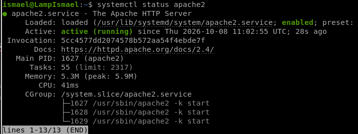
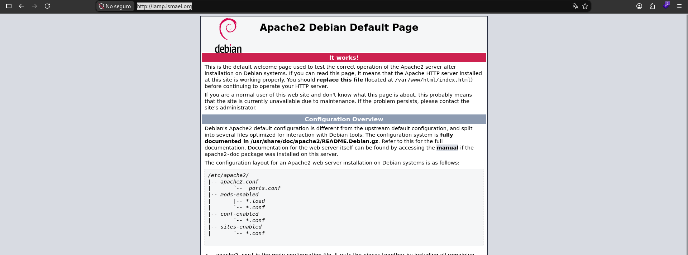
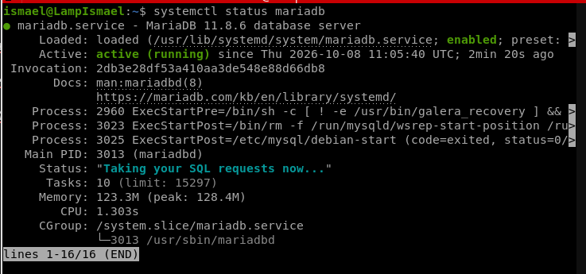
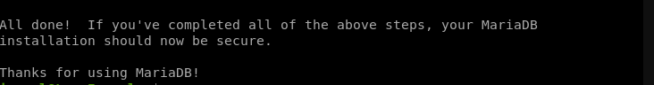
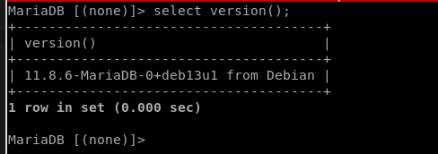
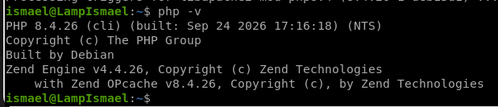
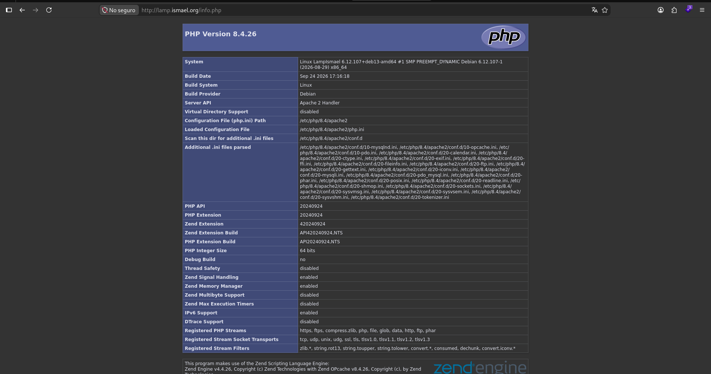

**LAMP** = **L**inux + **A**pache (servidor web) + **M**ariaDB (base de datos) + **P**HP (lenguaje del lado del servidor).

**Entorno:** máquina virtual Debian 13 creada con mi script, usuario `ismael`.

* TOC
{:toc}

## 1. Actualizar el sistema

```bash
sudo apt update && sudo apt upgrade -y
```

## 2. Instalar Apache

```bash
sudo apt install apache2 -y
systemctl status apache2
```



He guardado una resolución de nombre para la IP de la máquina en mi fichero /etc/hosts, con el nombre `lamp.ismael.org`.



## 3. Instalar MariaDB

```bash
sudo apt install mariadb-server -y
systemctl status mariadb
```



Asegurar la instalación (contraseña de root, quitar usuarios anónimos y la base de datos de prueba):

```bash
sudo mariadb-secure-installation
```

En MariaDB 11.x el comando se llama `mariadb-secure-installation` (el antiguo `mysql_secure_installation` ya no existe).



| Pregunta | Respuesta | Para qué sirve |
| --- | --- | --- |
| **Enter current password for root** | Enter (vacía) | root no tiene contraseña todavía |
| **Switch to unix_socket authentication?** | `n` | Dejarías root entrando solo con `sudo mariadb`; con `n` conservas ese acceso y además puedes poner contraseña |
| **Change the root password?** | `y` | Pones una contraseña para root de MariaDB |
| **Remove anonymous users?** | `y` | Borra usuarios sin nombre que permitirían entrar sin cuenta |
| **Disallow root login remotely?** | `y` | root solo puede conectarse desde la propia máquina |
| **Remove test database and access to it?** | `y` | Borra la base de datos `test`, que no hace falta y es accesible por cualquiera |
| **Reload privilege tables now?** | `y` | Aplica todos los cambios al momento |

Comprobación: entrar al cliente de MariaDB.

```bash
sudo mariadb
```

```sql
SELECT VERSION();
EXIT;
```



## 4. Instalar PHP

```bash
sudo apt install php libapache2-mod-php php-mysql -y
php -v
```

- `libapache2-mod-php`: permite a Apache ejecutar código PHP.
- `php-mysql`: permite a PHP conectarse a MariaDB.

Reiniciar Apache para que cargue el módulo de PHP:

```bash
sudo systemctl restart apache2
```



## 5. Probar la pila completa

Crear un fichero de prueba con nano:

```bash
sudo nano /var/www/html/info.php
```

Contenido:

```php
<?php phpinfo(); ?>
```

Abrir `http://lamp.ismael.org/info.php` en el navegador; debe aparecer la tabla de información de PHP (con el módulo `mysqli` cargado, que confirma la conexión PHP–MariaDB).



Borrar el fichero al terminar, porque expone información del servidor:

```bash
sudo rm /var/www/html/info.php
```
