* TOC
{:toc}

Repositorio usado: el de la práctica 1 (`practica1ismael`), ya enlazado a GitHub.

## 1. Creación de ramas

Crea una rama que se llame primera en tu local, y ejecuta la instrucción necesaria para comprobar que se ha creado.

```
cd ~/Documentos/ismael_vazquezferrero
git branch primera
git branch
```

- `git branch primera` crea la rama, pero no cambia a ella.
- `git branch` lista las ramas; la actual lleva un `*`.

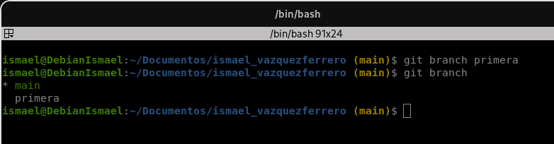

## 2. Trabaja con la rama

Crea un nuevo fichero en esta rama y fusiona con la principal. ¿Se ha producido conflicto? Razona la respuesta.

```
git checkout primera
echo "<h1>Página 2</h1>" > pagina2.html
git add pagina2.html
git commit -m "Añadida pagina2.html en la rama primera"
git checkout main
git merge primera
```

- `git checkout primera` cambia a la rama.
- `git merge primera` se ejecuta desde `main`: la rama en la que estás absorbe a la que indicas.
- `git push` para subir los cambios a la rama principal.

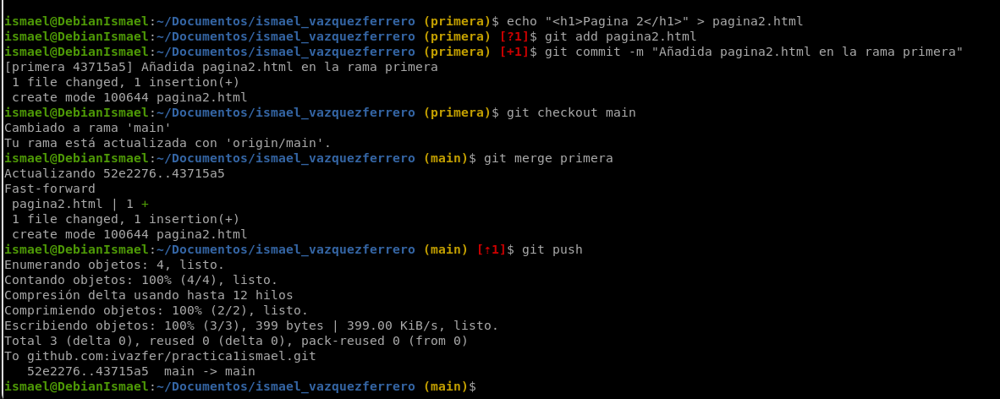

**No ha habido conflicto.** En `main` no se hizo ningún commit nuevo mientras existía `primera`, y en `primera` solo se añadió un fichero nuevo. Git no tiene nada que comparar, así que avanza `main` hasta el commit de `primera`.

## 3. Borra la rama primera

```
git branch -d primera
git branch
```

- `-d` solo borra si la rama ya está fusionada. `-D` fuerza el borrado aunque no lo esté.
- No se puede borrar la rama en la que estás, por eso se ejecuta desde `main`.

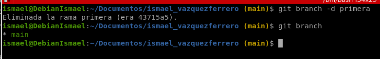

## 4. Provocar conflicto

Crea una rama que se llame segunda, y modifica un fichero en ella para producir un conflicto al unirlo a la rama principal. Entrega el contenido del fichero donde se ha producido el conflicto.

Un conflicto aparece cuando **la misma línea** se modifica de forma distinta en dos ramas. Cambio la línea del `<h1>` de `index.html` en cada una.

```
git checkout -b segunda
nano index.html        # cambiar a: <h1>Cambio de h1 en segunda</h1>
git add index.html
git commit -m "Cambio del h1 en segunda"
```

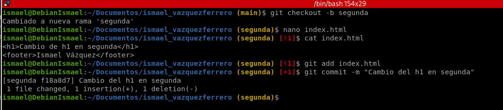

```
git checkout main
nano index.html        # cambiar a: <h1>Cambio del h1 en main</h1>
git add index.html
git commit -m "Cambio del h1 en main"
```

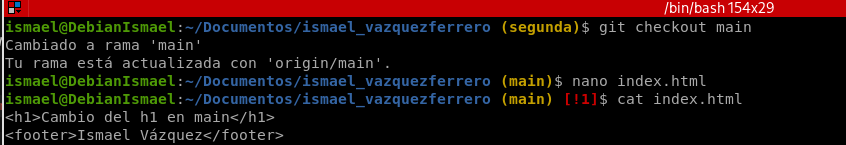

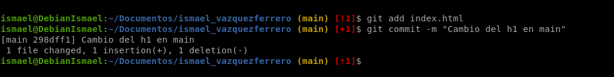

```
git merge segunda
git status
```

- `git checkout -b segunda` crea la rama y cambia a ella en un solo paso.
- `git status` muestra `index.html` como *both modified* (modificado en ambas).

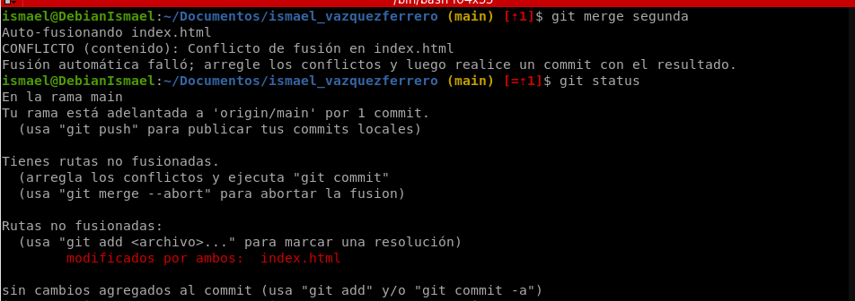

Contenido de `index.html` con el conflicto:

```html
<<<<<<< HEAD
<h1>Cambio del h1 en main</h1>
=======
<h1>Cambio de h1 en segunda</h1>
>>>>>>> segunda
<footer>Ismael Vázquez</footer>
```

- Entre `<<<<<<< HEAD` y `=======` está la versión de `main` (la rama actual).
- Entre `=======` y `>>>>>>> segunda` está la versión de `segunda`.

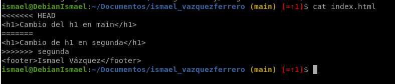

## 5. Resolución de conflictos

Soluciona el conflicto que has creado en el punto anterior y sincroniza la rama segunda en el remoto.

Edito `index.html` a mano: dejo una sola versión de la línea y borro las tres líneas de marcas (`<<<<<<<`, `=======`, `>>>>>>>`).

```
nano index.html
```

Resultado final:

```html
<h1>Hola main y segunda</h1>
<footer>Ismael Vázquez</footer>
```

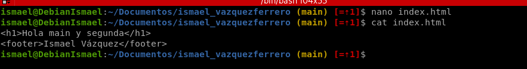

Marco el conflicto como resuelto y cierro el merge con un commit:

```
git add index.html
git commit -m "Resuelto conflicto entre main y segunda"
git log --oneline --graph
```

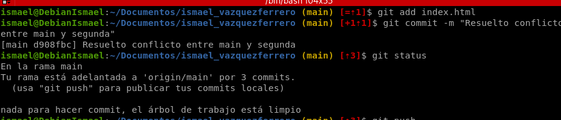

Sincronizo con GitHub (las ramas no se crean solas en el remoto, hay que hacer push):

```
git push
git push -u origin segunda
```

- `git add` indica a Git que el conflicto de ese fichero está resuelto.
- `git push -u origin segunda` crea la rama en GitHub y la enlaza, para usar solo `git push` en adelante.
- `git push` (desde `main`) sube también el merge de `main`.

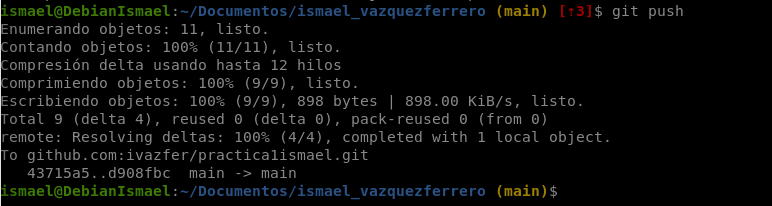

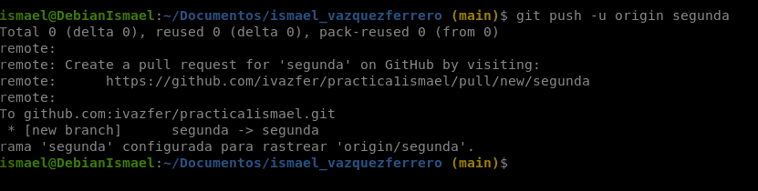

Con el comando `git log --oneline --graph` se puede ver de forma gráfica lo que ha pasado con la rama al hacer el merge y corregir los conflictos.

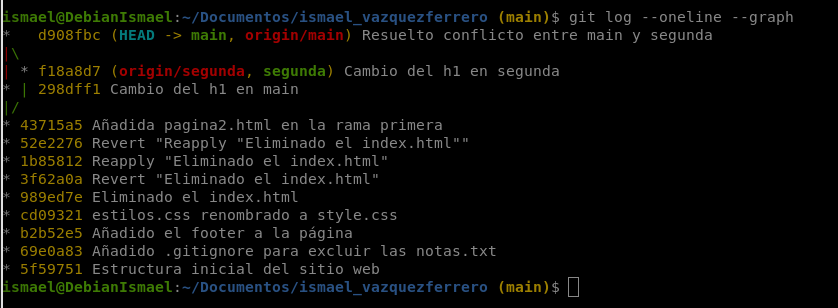

## Enlaces a los repositorios

- Práctica 1: [https://github.com/ivazfer/practica1ismael](https://github.com/ivazfer/practica1ismael)
- Rama segunda: [https://github.com/ivazfer/practica1ismael/tree/segunda](https://github.com/ivazfer/practica1ismael/tree/segunda)

## Conclusiones y problemas encontrados

He aprendido a crear, cambiar, fusionar y borrar ramas, a distinguir un merge sin conflicto de uno con conflicto, y a resolver un conflicto editando las marcas a mano y guardando el cambio con un commit.

No he encontrado ningún problema.
