* TOC
{:toc}

## Inicialización del repositorio

Crea una carpeta llamada tunombre_tusapellidos y conviértela en un repositorio Git.

```
ismael@DebianIsmael:~/Documentos$ mkdir ismael_vazquezferrero
ismael@DebianIsmael:~/Documentos$ cd ismael_vazquezferrero/
ismael@DebianIsmael:~/Documentos/ismael_vazquezferrero$ git init
```

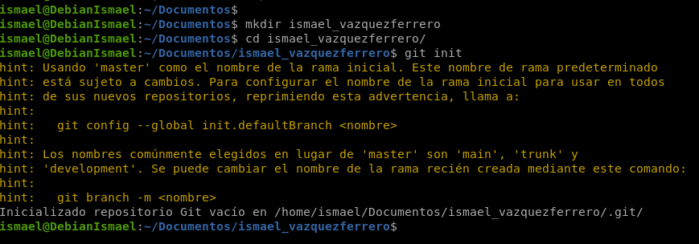

`git init` convierte la carpeta en un repositorio Git, creando la subcarpeta oculta `.git/` donde se guardará todo el historial, las ramas y la configuración.

### Primeros archivos

Dentro de la carpeta, crea los siguientes archivos con un contenido mínimo (puede ser solo un título o comentario):

- index.html
- estilos.css
- notas.txt (con anotaciones personales de trabajo, que no deben formar parte del repositorio)

```
ismael@DebianIsmael:~/Documentos/ismael_vazquezferrero$ echo "<h1>Hola</h1>" > index.html
ismael@DebianIsmael:~/Documentos/ismael_vazquezferrero$ echo "/*Estilo de la página*/" > estilos.css
ismael@DebianIsmael:~/Documentos/ismael_vazquezferrero$ echo "Notas personales" > notas.txt
```

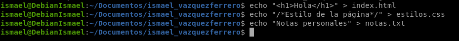

He creado 3 archivos con contenido dentro.

### Comprueba el estado del repositorio antes de añadir nada

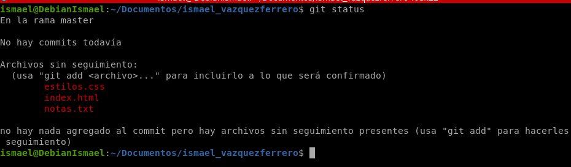

`git status` muestra el estado del área de trabajo.

### Primer commit

Añade al área de preparación (*staging*) index.html y estilos.css, pero no notas.txt. Verifica con status que solo esos dos archivos están preparados. Realiza el primer commit con un mensaje descriptivo, por ejemplo: *"Estructura inicial del sitio web"*.

```
git add index.html estilos.css
git status
git commit -m "Estructura inicial del sitio web"
```

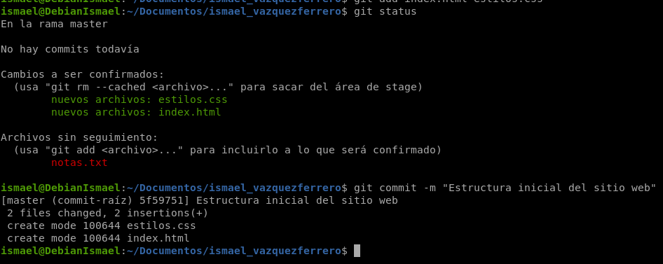

- `git add index.html estilos.css` mueve solo esos dos archivos al área de preparación, dejando `notas.txt` fuera.
- El segundo `git status` muestra `index.html` y `estilos.css` como cambios a ser confirmados y `notas.txt` como sin seguimiento, confirmando que solo esos dos entrarán en el commit.
- `git commit -m "..."` crea una instantánea.

### Ignorar archivos

¿Por qué consideras que puede ser necesario evitar que algunos archivos sean incluidos en nuestro repositorio? Investiga sobre el fichero .gitignore y cómo tendrías que configurarlo para evitar tener que acordarte de excluir notas.txt manualmente cada vez.

Es necesario porque no todos los archivos deben guardarse en el repositorio, ya que puede haber archivos que no conviene subir, como notas personales, contraseñas, etc.

Si estos archivos se suben, pueden revelar información importante.

```
echo "notas.txt" > .gitignore
git add .gitignore
git commit -m "Añadido .gitignore para excluir las notas.txt"
```

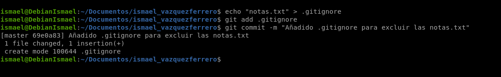

El archivo `.gitignore` sirve para decirle a Git qué archivos debe ignorar. Así los archivos como notas.txt no aparecerán para añadirlos al repositorio. Esto funciona si el archivo todavía no está siendo seguido por Git.

### Modificación y comparación

Edita index.html añadiendo una nueva sección (por ejemplo, un `<footer>`). Antes de hacer commit, usa el comando adecuado para ver exactamente qué líneas han cambiado respecto a la última versión guardada.

He añadido al footer mi nombre y apellido.

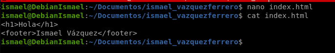

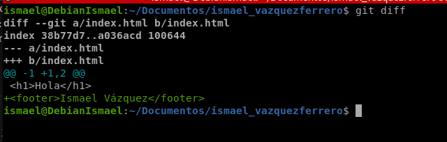

`git diff` compara el área de trabajo con el último commit y muestra, línea a línea, qué se ha añadido (+) o eliminado (-).

### Segundo commit

Guarda los cambios anteriores en un nuevo commit con mensaje: *"Añadido footer a la página principal"*.

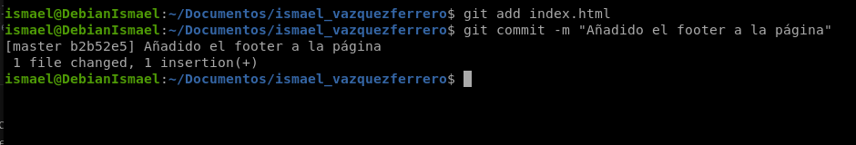

Guardamos el cambio del footer como una nueva instantánea independiente del commit anterior.

### Renombrar un archivo

El cliente pide que el archivo de estilos se llame styles.css en lugar de estilos.css. Realiza el cambio de nombre de forma que Git lo registre correctamente (no valdría borrar y crear uno nuevo por separado). Confirma con status que Git detecta el renombrado. Haz commit del cambio.

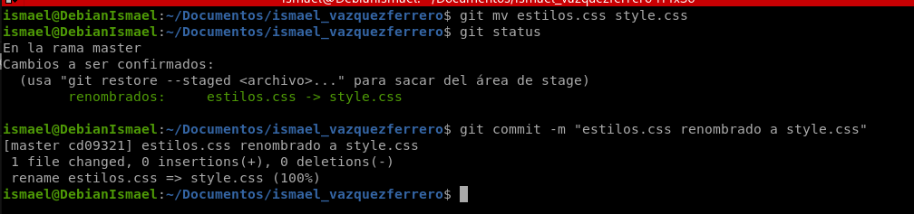

`git mv` renombra el archivo en el sistema de ficheros **y** registra el cambio.

### Eliminar un archivo

El archivo index.html ya no es necesario. Elimínalo tanto del sistema de archivos como del repositorio usando el comando de Git adecuado.

```
git rm index.html
git commit -m "Eliminado el index.html"
```

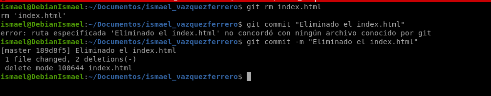

`git rm` borra el archivo del disco y lo marca como eliminado en el staging.

### Un commit erróneo

Por error hemos borrado index.html de forma incorrecta. Deshaz solo el último commit, ¿qué dos formas tendríamos para deshacerlo?

#### Opción A: git reset --hard HEAD~1

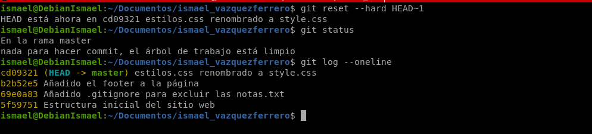

`reset` tiene varios modos según cuánto deshace. `--hard` es el más radical: elimina el último commit del historial, limpia el staging, y además actualiza tu carpeta de trabajo al estado exacto de ese commit anterior.

#### Opción B: git revert HEAD

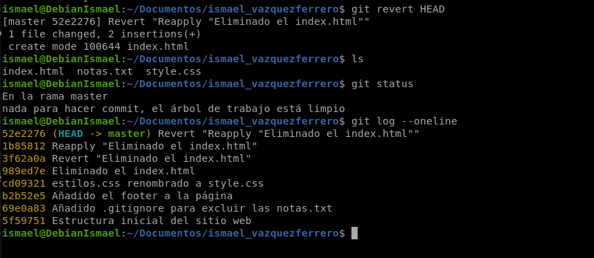

No toca el historial, el commit erróneo se queda como constancia de lo que pasó. En su lugar crea un commit nuevo que aplica el cambio contrario, en este caso, vuelve a añadir index.html automáticamente.

## Conclusiones y problemas encontrados

He aprendido a usar Git de forma básica. El año pasado ya lo usé, pero no utilicé comandos más completos como git diff, git status ni git reset.
