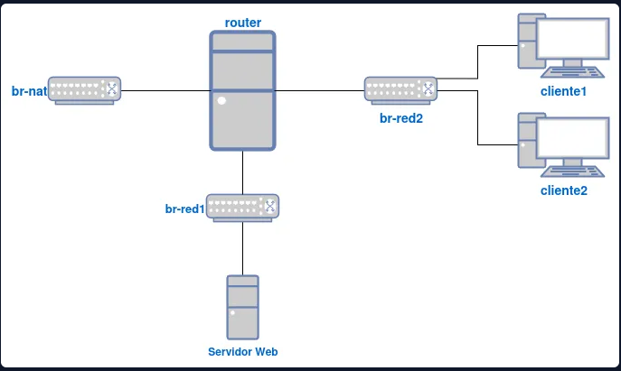

## 🎯 ¿Qué vamos a hacer en esta práctica?

<aside>
🎯

Vamos a montar, sobre máquinas virtuales (KVM/libvirt), un **router Linux** que conecta dos redes internas con el exterior. El router dará salida a internet a las máquinas internas (**SNAT**), publicará un servidor web interno (**DNAT**) y repartirá direcciones IP automáticamente (**DHCP** con Kea).

</aside>

Esta práctica reproduce, a pequeña escala, lo que hace un router de borde en una red real: separar las redes internas de la red externa y controlar qué tráfico entra y sale. Se trabajan tres bloques:

1. **Enrutamiento y NAT**: el router tiene tres interfaces (una hacia internet en modo NAT y dos hacia las redes internas *aislada* y *muy aislada*). Se activa el *IP forwarding* para que reenvíe tráfico entre ellas, se configuran reglas de **SNAT** para que las máquinas internas (sin IP pública) salgan a internet con la IP del router, y una regla de **DNAT** para publicar el servidor web interno hacia el exterior.
2. **Acceso remoto seguro**: acceso SSH por clave pública, usando `ssh -A` para llegar a las máquinas internas a través del router sin dejar la clave privada en él (el router actúa de *jump host*).
3. **Servicio DHCP**: instalar un servidor DHCP (**Kea**) en el router para las dos redes internas, capturar el intercambio `DISCOVER/OFFER/REQUEST/ACK`, estudiar cómo reaccionan un cliente Linux y uno Windows cuando el servidor se apaga o cambia su configuración, crear una reserva para el servidor web y, por último, pasar la IP pública del router a dinámica y adaptar el SNAT con *enmascaramiento*.

### 🗺️ El escenario

```
               INTERNET
                  │
            red NAT (br-nat)
           192.168.100.0/24
                  │
           ┌──────┴──────┐
           │   ROUTER    │  Debian 13 · iptables · Kea DHCP
           └──┬───────┬──┘
  192.168.10.2│       │172.16.0.1
 red aislada  │       │  red muy aislada
 (br-red1)    │       │  (br-red2)
192.168.10.0/24       172.16.0.0/16
              │       │
       ┌──────┴───┐   ├───────────┐
       │   web    │   │ cliente1  │ cliente2
       │ Ubuntu   │   │ Fedora    │ Windows 11
       │ Apache   │   └───────────┘
       └──────────┘
```

| Máquina | Sistema | Función | IP inicial (estática) |
| --- | --- | --- | --- |
| `router` | Debian 13 (sin entorno gráfico) | Router, NAT y servidor DHCP | 192.168.100.2 · 192.168.10.2 · 172.16.0.1 |
| `web` | Ubuntu Server | Servidor web (Apache2) | 192.168.10.3 |
| `cliente1` | Fedora | Cliente Linux | 172.16.0.2 |
| `cliente2` | Windows 11 | Cliente Windows | 172.16.0.3 |

| Red | Bridge | Direccionamiento | Máquinas conectadas |
| --- | --- | --- | --- |
| NAT | `br-nat` | 192.168.100.0/24 (sin DHCP) | router |
| Aislada | `br-red1` | 192.168.10.0/24 (sin DHCP) | router, web |
| Muy aislada | `br-red2` | 172.16.0.0/16 | router, cliente1, cliente2 |

### 🧭 Cómo está organizada la práctica

- **Parte 1 — direccionamiento estático**: bridges, interfaces, SSH con clave, *forwarding*, SNAT y DNAT, y resolución de problemas.
- **Parte 2 — servidor DHCP**: ámbitos, concesiones, comportamiento de los clientes, reserva para el servidor web y SNAT con enmascaramiento.

<aside>
💡

**En resumen**: entender **por qué** un router necesita *forwarding* + NAT para dar salida a redes internas, **por qué** hace falta DNAT para publicar un servicio interno y **cómo** DHCP automatiza la configuración de los clientes.

</aside>

## Parte 1

### 1. Configuración de red de las máquinas

Comprobación de que las máquinas conectadas en distintas redes hacen ping entre ellas (se usa una de las máquinas conectadas a la red **muy aislada**).

#### 1.1 Creación de los bridges

Voy a crear primero los bridges de red: `br-nat`, `br-red1` (aislada) y `br-red2` (muy aislada).

Para crear las redes usaré unos ficheros XML con la configuración de cada bridge, y las registraré con `virsh net-define`.

```xml
<network>
  <name>nat</name>
  <forward mode='nat'/>
  <bridge name='br-nat' stp='on' delay='0'/>
  <ip address='192.168.100.1' netmask='255.255.255.0'/>
</network>
```

```xml
<network>
  <name>aislada</name>
  <bridge name='br-red1' stp='on' delay='0'/>
  <ip address='192.168.10.1' netmask='255.255.255.0'/>
</network>
```

```xml
<network>
  <name>muy_aislada</name>
  <bridge name='br-red2' stp='on' delay='0'/>
</network>
```

Una vez creados los ficheros `.xml`, las defino, las arranco y las configuro para que se inicien automáticamente:

```bash
virsh net-define br-nat.xml
virsh net-define br-red1.xml
virsh net-define br-red2.xml

virsh net-start nat
virsh net-start aislada
virsh net-start muy_aislada

virsh net-autostart nat
virsh net-autostart aislada
virsh net-autostart muy_aislada
```

#### 1.2 Conectar el router a las redes

Como router uso una máquina Debian 13 que ya tenía creada previamente, así que le hago un *attach* de los bridges. Esta máquina queda conectada a las tres redes: NAT, aislada y muy aislada.

Con `virsh detach-interface` quito primero la interfaz que tenía por defecto, apuntando a su MAC:

```bash
virsh domiflist router
Interface  Type      Source     Model    MAC
vnet0      network   default    virtio   52:54:00:xx:xx:xx
...
```

```bash
virsh detach-interface router network --mac 52:54:00:48:97:83 --persistent
La interfaz ha sido desmontada exitosamente
```

Y ahora le añado las tres interfaces nuevas:

```bash
virsh attach-interface router network br-nat --model virtio --persistent --config
virsh attach-interface router network aislada --model virtio --persistent --config
virsh attach-interface router network muy_aislada --model virtio --persistent --config
La interfaz ha sido asociada exitosamente
```

<aside>
⚠️

Si al arrancar la máquina da error por `virtio0`, hay que ejecutar `virsh edit router` y cambiar las líneas donde ponga `virtio0` por `virtio`.

</aside>

Comprobación con `domiflist`:

```bash
virsh domiflist router
Interfaz   Tipo      Fuente        Modelo   MAC
----------------------------------------------------------------
 -          network   br-nat        virtio   52:54:00:5b:db:45
 -          network   aislada       virtio   52:54:00:93:51:fe
 -          network   muy_aislada   virtio   52:54:00:91:0a:95
```

Haciendo un `ip a` en la máquina y comparando las MAC de las interfaces del host con las de la VM, se puede saber a cuál bridge pertenece cada una. Así se puede configurar correctamente el fichero `/etc/network/interfaces`.

#### 1.3 Instalación de Fedora (cliente1)

```bash
virt-install --virt-type kvm --name cliente1 --cdrom Documentos/ISO/Fedora-Workstation-Live-44-1.7.x86_64.iso --os-variant fedora42 --disk pool=default,size=10,format=qcow2 --memory 2048 --vcpus 2 --network network=muy_aislada
```

Configuración de red por comandos (`nmcli`):

```bash
nmcli connection show
NAME                 UUID                                  TYPE      DEVICE 
Conexión cableada 1  048a4d4f-0e7e-3995-87a7-73127dc7d21c  ethernet  enp1s0 

sudo nmcli connection modify "Conexión cableada 1" \
  ipv4.method manual \
  ipv4.addresses 172.16.0.2/16 \
  ipv4.gateway 172.16.0.1 \
  ipv4.dns "8.8.8.8"

sudo nmcli connection up "Conexión cableada 1"
```

Para volver a configuración dinámica (DHCP), en vez de `manual` pongo `ipv4.method auto` y vacío los valores fijos:

```bash
sudo nmcli connection modify "Conexión cableada 1" \
  ipv4.method auto \
  ipv4.addresses "" \
  ipv4.gateway "" \
  ipv4.dns ""

sudo nmcli connection up "Conexión cableada 1"
```

#### 1.4 Activar SSH en Fedora

```bash
sudo dnf install openssh-server
sudo systemctl enable --now sshd
sudo firewall-cmd --permanent --add-service=ssh
sudo firewall-cmd --reload
sudo systemctl status sshd
```

#### 1.5 Configuración de red en Ubuntu Server (Servidor Web) — Netplan

```bash
sudo cat /etc/netplan/00-installer-config.yaml 
# This is the network config written by 'subiquity'
network:
  ethernets:
    enp1s0:
      addresses:
      - 192.168.10.3/24
      match:
        macaddress: 52:54:00:3c:c9:02
      nameservers:
        addresses:
        - 192.168.122.1
        search: []
      routes:
      - to: default
        via: 192.168.10.1
      set-name: enp1s0
  version: 2
```

#### 1.6 Acceso SSH con clave pública

Para meter la clave pública en los servidores uso `ssh-copy-id`, y entro en el router con `ssh -A` para poder hacer desde ahí el `ssh-copy-id` a los demás servidores a los que no tengo acceso directo desde el host.

1. Desde el equipo local, copio la clave pública al router: `ssh-copy-id ismael@192.168.100.2`
2. Entro al router reenviando el agente SSH (`-A`), para usar mi clave local sin guardar la privada en el router: `ssh -A ismael@192.168.100.2`
3. Desde el router, copio la misma clave a los demás equipos de las otras redes:
    - `ssh-copy-id 192.168.10.3`
    - `ssh-copy-id 172.16.0.2`

### 2. Habilitar forwarding IP en el router (persistente)

Para que el router reenvíe tráfico entre sus distintas interfaces (por ejemplo, para hacer ping entre máquinas de `red_aislada` y `red_muy_aislada`), hace falta activar el bit de IP forwarding. En Debian 13 no existe `/etc/sysctl.conf` por defecto, así que se usa un fichero propio en `/etc/sysctl.d/`:

```bash
echo "net.ipv4.ip_forward=1" | sudo tee /etc/sysctl.d/99-ip-forward.conf
sudo sysctl --system
```

Comprobación:

```bash
sysctl net.ipv4.ip_forward
```

Debe devolver `1`. Al estar en `/etc/sysctl.d/`, `systemd-sysctl.service` lo aplica automáticamente en cada arranque, por lo que es persistente sin necesitar nada más.

### 3. Reglas iptables en el router (SNAT y DNAT)

He creado el script `/etc/reglas.sh` en el router, le he dado permisos de ejecución y lo llamo con `up` desde `/etc/network/interfaces`, así las reglas se aplican en cada arranque:

```
# The primary network interface
auto enp1s0
iface enp1s0 inet static
	address 192.168.100.2
	netmask 255.255.255.0
	gateway 192.168.100.1
	up /etc/reglas.sh
```

Contenido de `/etc/reglas.sh` con las reglas de SNAT y DNAT:

```bash
#!/bin/bash
iptables -F
iptables -X

iptables -P INPUT ACCEPT
iptables -P OUTPUT ACCEPT
iptables -P FORWARD ACCEPT

iptables -t nat -A POSTROUTING -s 192.168.10.0/24 -o enp1s0 -j SNAT --to 192.168.100.2
iptables -t nat -A POSTROUTING -s 172.16.0.0/16 -o enp1s0 -j SNAT --to 192.168.100.2

iptables -t nat -A PREROUTING -d 192.168.100.2 -p tcp --dport 80 -i enp1s0 -j DNAT --to 192.168.10.3
iptables -t nat -A PREROUTING -d 172.16.0.1 -p tcp --dport 80 -i enp8s0 -j DNAT --to 192.168.10.3
```

#### 3.1 ¿Hace falta enmascaramiento (MASQUERADE)?

El enunciado pregunta si es necesario usar *enmascaramiento*. Aquí no: la IP del router en la red NAT (`192.168.100.2`) es **fija**, así que basta con `SNAT --to 192.168.100.2`. El *enmascaramiento* (`MASQUERADE`) solo hace falta cuando esa IP de salida es dinámica y puede cambiar.

### 4. Permitir ping (ICMP) hacia Windows (cliente2)

cliente2 es un Windows 11 en versión Tiny (sin navegador ni apenas herramientas). Aunque el resto de la red, el enrutamiento y las reglas de `iptables` del router estaban bien, el ping desde `web` (Ubuntu) hacia `172.16.0.3` no respondía. El motivo es que **el Firewall de Windows bloquea las peticiones ICMP entrantes por defecto**, algo que no ocurre en las máquinas Linux.

Comprobación de la tarjeta de red: la interfaz virtual de esta VM usa el modelo `e1000e` (no `virtio`), por lo que Windows la reconoce de forma nativa sin necesitar instalar ningún driver adicional (no hace falta el ISO de `virtio-win`/NetKVM en este caso).

Desde PowerShell como administrador, se crea una regla de entrada que permite el ping (ICMPv4 tipo 8, echo request):

```powershell
New-NetFirewallRule -DisplayName "PingAllow" -Protocol ICMPv4 -IcmpType 8 -Direction Inbound -Action Allow
```

Comprobación de que la regla se ha creado:

```powershell
Get-NetFirewallRule -DisplayName "PingAllow"
```

<aside>
⚠️

Ojo al copiar/pegar comandos de PowerShell: si las comillas se convierten en comillas "curvas" (" ") en vez de rectas ("), el comando se corta a mitad y crea una regla con un nombre incompleto (por ejemplo, solo "Allow"). Mejor escribir el comando directamente en la consola si da error de parámetro no encontrado.

</aside>

Con la regla activa, el ping desde el resto de máquinas (por ejemplo, desde `web`) responde correctamente:

```bash
ping -c3 172.16.0.3
```

### 5. Resolución de problemas

#### 5.1 SSH a cliente1 (172.16.0.2) se queda colgado

**Síntoma**

El `ping` a `172.16.0.2` funcionaba, pero `ssh 172.16.0.2` se quedaba bloqueado sin pedir contraseña, aunque `ssh-copy-id` había funcionado antes.

**Diagnóstico**

Con `ssh -v 172.16.0.2` se vio que se paraba en:

```bash
debug1: Next authentication method: gssapi-with-mic
```

La autenticación GSSAPI/Kerberos hace consultas DNS. En la red aislada no hay salida a un DNS, así que SSH esperaba a que venciera el timeout.

**Solución temporal**

```bash
ssh -o GSSAPIAuthentication=no 172.16.0.2
```

**Solución definitiva (en cliente1, Fedora)**

Cambié `GSSAPIAuthentication no` en `/etc/ssh/sshd_config`, pero no hizo efecto. Al comprobarlo con `sudo sshd -T | grep -i gssapiauthentication` seguía saliendo `yes`.

Con `sudo grep -ri gssapi /etc/ssh/sshd_config /etc/ssh/sshd_config.d/` vi que el valor estaba definido en `/etc/ssh/sshd_config.d/50-redhat.conf` (`GSSAPIAuthentication yes`). En `sshd` gana el primer valor que encuentra, y en Fedora los ficheros de `sshd_config.d/` se incluyen antes que el resto de `sshd_config`, por lo que mi línea se ignoraba.

Creé un fichero que se lee antes (orden alfabético):

```bash
echo -e "GSSAPIAuthentication no\nUseDNS no" | sudo tee /etc/ssh/sshd_config.d/00-custom.conf
sudo systemctl restart sshd
```

**Comprobación**

```bash
sudo sshd -T | grep -i gssapiauthentication
```

Debe salir `gssapiauthentication no`, y `ssh 172.16.0.2` desde el router entra al instante.

**Notas**

- En Fedora el servicio se llama `sshd` (en Debian es `ssh`).
- Es mejor usar `00-custom.conf` que editar `50-redhat.conf`, porque una actualización de `openssh-server` podría restaurar este último.

## Respuestas a las preguntas de la Parte 1

**¿Para qué sirve `ssh -A` al acceder al router y desde ahí a las máquinas internas? ¿Qué problema de seguridad evita frente a copiar tu clave privada dentro del router?**

`ssh -A` activa el *reenvío del agente SSH* (agent forwarding): el agente que corre en mi equipo local queda accesible desde el router a través de un socket temporal, de forma que cuando desde el router hago `ssh` hacia `cliente1` o `web`, la petición de firma se reenvía de vuelta a mi agente local y se firma allí, sin que la clave privada salga nunca de mi máquina.

Si en vez de esto copiara la clave privada al router, cualquiera con acceso al router (otro usuario, un atacante que lo comprometa, un backup mal protegido...) podría usarla para autenticarse como yo en cualquier máquina donde esté la pública, incluidas las que quedan fuera de este escenario. Con `ssh -A` el router nunca llega a tener la clave, solo actúa de intermediario para la conversación con el agente.

**¿Se puede acceder a la máquina Servidor Web desde el exterior sin acceder por el router? Razona tu respuesta.**

Sí, pero solo desde el propio host (el hipervisor), no desde "el exterior" real. El host también está conectado al bridge `br-red1` (es el propio bridge el que crea la interfaz en el host), así que tiene una IP dentro de esa red y puede llegar directamente al Servidor Web sin pasar por las reglas del router. Para cualquier otra máquina fuera del host, en cambio, `br-red1` no tiene salida ni ruta propia: la única forma de llegar es a través de la regla DNAT del router, que redirige el puerto 80 de su IP hacia `192.168.10.3`.

## Parte 2

**Vamos a seguir trabajando con el escenario de la parte anterior.**

### 1. Instalación del servidor DHCP (red muy aislada)

**Instala un servidor DHCP en la máquina** `router.tunombre.org` **con un ámbito que tenga las siguientes características:**

- Tiene que ofrecer configuración automática para los equipos clientes de la **red muy aislada**.
- Determinar el rango de direcciones, la máscara de red, la puerta de enlace, el servidor DNS y la dirección de broadcast.
- Duración de la concesión: 30 minutos.

#### 1.1 Instalación del paquete

Voy a instalar el servidor DHCP en el `router`. Uso **Kea**, el servidor DHCP moderno de ISC:

```bash
sudo apt update
sudo apt install kea-dhcp4-server
```

Esto instala el servicio `kea-dhcp4-server` y crea el fichero de configuración `/etc/kea/kea-dhcp4.conf`.

#### 1.2 Localizar la interfaz de la red muy aislada

Kea solo debe escuchar en la interfaz conectada a `br-red2` (la red muy aislada), no en todas las del router. Comparo las MAC del `virsh domiflist router` con las de `ip a` en el router para identificarla:

```bash
ip a
```

Anoto el nombre de la interfaz cuya MAC coincide con la de `muy_aislada` (`52:54:00:91:0a:95`).

#### 1.3 Configuración de /etc/kea/kea-dhcp4.conf

Hago una copia de seguridad del fichero original antes de modificarlo:

```bash
sudo cp /etc/kea/kea-dhcp4.conf /etc/kea/kea-dhcp4.conf.orig
```

Y lo dejo así (el objeto raíz es `Dhcp4`, como indica la documentación de Kea):

```json
{
  "Dhcp4": {
    "interfaces-config": {
      "interfaces": [ "enp8s0" ]
    },
    "lease-database": {
      "type": "memfile",
      "persist": true,
      "name": "/var/lib/kea/kea-leases4.csv"
    },
    "valid-lifetime": 1800,
    "max-valid-lifetime": 1800,
    "subnet4": [
      {
        "id": 1,
        "subnet": "172.16.0.0/16",
        "pools": [
          { "pool": "172.16.0.10 - 172.16.255.254" }
        ],
        "option-data": [
          { "name": "routers", "data": "172.16.0.1" },
          { "name": "domain-name-servers", "data": "192.168.100.1" },
          { "name": "broadcast-address", "data": "172.16.255.255" }
        ]
      }
    ]
  }
}
```

<aside>
ℹ️

`valid-lifetime` y `max-valid-lifetime` van en segundos: 1800 s = 30 minutos, la duración de concesión que pide el enunciado. El rango deja fuera la `172.16.0.1` (IP fija del router en esa red). `id` es obligatorio en esta versión de Kea (2.6.3) para identificar cada subred. Como DNS uso `192.168.100.1` (la puerta de enlace de `br-nat`), porque en la red del instituto no hay salida directa a un DNS público como `8.8.8.8`: esa IP la gestiona el `dnsmasq` interno de libvirt, que reenvía las consultas usando la resolución DNS real del anfitrión.

</aside>

#### 1.4 Validar y arrancar el servicio

Primero valido la sintaxis del fichero sin arrancar el servicio:

```bash
sudo kea-dhcp4 -t /etc/kea/kea-dhcp4.conf
```

Si no da error, reinicio el servicio y lo dejo persistente al arranque:

```bash
sudo systemctl restart kea-dhcp4-server
sudo systemctl enable kea-dhcp4-server
sudo systemctl status kea-dhcp4-server
```

Y reviso los logs para ver las peticiones DHCP en directo:

```bash
sudo journalctl -u kea-dhcp4-server -n 50 --no-pager
```

### 2. Configuración dinámica de los clientes

**Configura las máquinas cliente1 y cliente2 para que tomen configuración de red dinámica y puedas probar que realmente está funcionando el servidor.**

Cliente1

```bash
sudo nmcli connection modify "Conexión cableada 1" \
  ipv4.method auto \
  ipv4.addresses "" \
  ipv4.gateway "" \
  ipv4.dns ""

sudo nmcli connection up "Conexión cableada 1"
```

**Cliente1** — configuración de red obtenida por DHCP

```bash
ismael@cliente1:~$ ip a show enp1s0
2: enp1s0: <BROADCAST,MULTICAST,UP,LOWER_UP> mtu 1500 qdisc fq_codel state UP group default qlen 1000
    link/ether 52:54:00:5f:b4:cf brd ff:ff:ff:ff:ff:ff
    altname enx5254005fb4cf
    inet 172.16.0.10/16 brd 172.16.255.255 scope global dynamic noprefixroute enp1s0
       valid_lft 1125sec preferred_lft 1125sec
    inet6 fe80::baa1:1a59:4e8f:532b/64 scope link noprefixroute 
       valid_lft forever preferred_lft forever
       
ismael@cliente1:~$ ip route show
default via 172.16.0.1 dev enp1s0 proto dhcp src 172.16.0.10 metric 100 
172.16.0.0/16 dev enp1s0 proto kernel scope link src 172.16.0.10 metric 100 

ismael@cliente1:~$ resolvectl status
Link 2 (enp1s0)
Current DNS Server: 172.22.0.1
       DNS Servers: 172.22.0.1
     Default Route: yes
ismael@cliente1:~$ 

```

**Cliente2** — configuración de red (`ipconfig /all`)

```
C:\Users\ismael>ipconfig /all

Configuración IP de Windows

   Nombre de host. . . . . . . . . . . : cliente2
   Sufijo DNS principal  . . . . . . . : ismael.org
   Tipo de nodo. . . . . . . . . . . . : híbrido
   Enrutamiento IP habilitado. . . . . : no
   Proxy WINS habilitado . . . . . . . : no
   Lista de búsqueda de sufijos DNS . . : ismael.org

Adaptador de Ethernet Ethernet:

   Sufijo DNS específico para la conexión. . :
   Descripción . . . . . . . . . . . . : Intel(R) 82574L Gigabit Network Connection
   Dirección física. . . . . . . . . . : 52-54-00-2B-F7-CA
   DHCP habilitado . . . . . . . . . . : sí
   Configuración automática habilitada. : sí
   Vínculo: dirección IPv6 local. . . . : fe80::115b:fef0:3531:e2aa%6(Preferido)
   Dirección IPv4. . . . . . . . . . . : 172.16.0.11(Preferido)
   Máscara de subred . . . . . . . . . : 255.255.0.0
   Concesión obtenida. . . . . . . . . : lunes, 28 de septiembre de 2026 18:43:48
   La concesión expira . . . . . . . . : lunes, 28 de septiembre de 2026 19:13:48
   Puerta de enlace predeterminada . . : 172.16.0.1
   Servidor DHCP . . . . . . . . . . . : 172.16.0.1
   IAID DHCPv6 . . . . . . . . . . . . : 106058752
   DUID de cliente DHCPv6 . . . . . . . : 00-01-00-01-32-45-D9-BB-52-54-00-2B-F7-CA
   Servidores DNS. . . . . . . . . . . : 172.22.0.1
```

**Concesiones del servidor** (Kea) 

He usado el comando `column -s, -t /var/lib/kea/kea-leases4.csv | less -S`

```bash
172.16.0.10  52:54:00:5f:b4:cf  01:52:54:00:5f:b4:cf  1800            1790615359  1          0         0         cliente1              0                    0
172.16.0.11  52:54:00:2b:f7:ca  01:52:54:00:2b:f7:ca  1800            1790615631  1          0         0         cliente2.ismael.org.  0                    0
```

### 3. Captura de la concesión con tcpdump

**Realizar una captura, desde el servidor usando** `tcpdump`**, de los cuatro paquetes que corresponden a una concesión:** `DISCOVER`**,** `OFFER`**,** `REQUEST`**,** `ACK`**.**

Primero se deja escuchando al servidor usando tcpdump.

```bash
ismael@router:~$ sudo tcpdump -i enp8s0 -n -v port 67 or port 68
```

Con eso corriendo, desde **cliente1** (u otro cliente) fuerza una concesión nueva completa. Como ya tiene IP asignada, si solo haces `dhclient` puede intentar una renovación *unicast* (sin DISCOVER/OFFER). Para forzar el DORA completo, primero libera la IP y luego la vuelve a pedir:

```bash
sudo dhclient -r enp1s0
sudo dhclient enp1s0
```

Paquetes capturados

```bash
ismael@router:~$ sudo tcpdump -i enp8s0 -n -v port 67 or port 68
tcpdump: listening on enp8s0, link-type EN10MB (Ethernet), snapshot length 262144 bytes
19:18:16.365249 IP (tos 0x10, ttl 128, id 0, offset 0, flags [none], proto UDP (17), length 328)
    0.0.0.0.68 > 255.255.255.255.67: BOOTP/DHCP, Request from 52:54:00:5f:b4:cf, length 300, xid 0x62bd1920, Flags [none]
	  Client-Ethernet-Address 52:54:00:5f:b4:cf
	  Vendor-rfc1048 Extensions
	    Magic Cookie 0x63825363
	    DHCP-Message (53), length 1: Discover
	    Parameter-Request (55), length 13: 
	      Subnet-Mask (1), BR (28), Time-Zone (2), Classless-Static-Route (121)
	      Domain-Name (15), Domain-Name-Server (6), Hostname (12), YD (40)
	      YS (41), NTP (42), MTU (26), Unknown (119)
	      Default-Gateway (3)
19:18:16.366188 IP (tos 0x10, ttl 128, id 0, offset 0, flags [DF], proto UDP (17), length 308)
    172.16.0.1.67 > 172.16.0.10.68: BOOTP/DHCP, Reply, length 280, xid 0x62bd1920, Flags [none]
	  Your-IP 172.16.0.10
	  Client-Ethernet-Address 52:54:00:5f:b4:cf
	  Vendor-rfc1048 Extensions
	    Magic Cookie 0x63825363
	    DHCP-Message (53), length 1: Offer
	    Subnet-Mask (1), length 4: 255.255.0.0
	    Default-Gateway (3), length 4: 172.16.0.1
	    Domain-Name-Server (6), length 4: 8.8.8.8
	    BR (28), length 4: 172.16.255.255
	    Lease-Time (51), length 4: 1800
	    Server-ID (54), length 4: 172.16.0.1
19:18:16.367322 IP (tos 0x10, ttl 128, id 0, offset 0, flags [none], proto UDP (17), length 328)
    0.0.0.0.68 > 255.255.255.255.67: BOOTP/DHCP, Request from 52:54:00:5f:b4:cf, length 300, xid 0x62bd1920, Flags [none]
	  Client-Ethernet-Address 52:54:00:5f:b4:cf
	  Vendor-rfc1048 Extensions
	    Magic Cookie 0x63825363
	    DHCP-Message (53), length 1: Request
	    Server-ID (54), length 4: 172.16.0.1
	    Requested-IP (50), length 4: 172.16.0.10
	    Parameter-Request (55), length 13: 
	      Subnet-Mask (1), BR (28), Time-Zone (2), Classless-Static-Route (121)
	      Domain-Name (15), Domain-Name-Server (6), Hostname (12), YD (40)
	      YS (41), NTP (42), MTU (26), Unknown (119)
	      Default-Gateway (3)
19:18:16.368044 IP (tos 0x10, ttl 128, id 0, offset 0, flags [DF], proto UDP (17), length 308)
    172.16.0.1.67 > 172.16.0.10.68: BOOTP/DHCP, Reply, length 280, xid 0x62bd1920, Flags [none]
	  Your-IP 172.16.0.10
	  Client-Ethernet-Address 52:54:00:5f:b4:cf
	  Vendor-rfc1048 Extensions
	    Magic Cookie 0x63825363
	    DHCP-Message (53), length 1: ACK
	    Subnet-Mask (1), length 4: 255.255.0.0
	    Default-Gateway (3), length 4: 172.16.0.1
	    Domain-Name-Server (6), length 4: 8.8.8.8
	    BR (28), length 4: 172.16.255.255
	    Lease-Time (51), length 4: 1800
	    Server-ID (54), length 4: 172.16.0.1
4 packets captured
4 packets received by filter
0 packets dropped by kernel
```

### 4. Apagado del servidor DHCP con concesión activa

**Para hacer esta prueba configura un tiempo de concesión bajo (cuando termines, vuelve a poner los 30 minutos). Los clientes toman una configuración, y a continuación apagamos el servidor DHCP. Comprueba qué ocurre en el cliente windows y en el cliente linux mientras dura la concesión y cuando intentan renovarla, y razona el motivo.**

#### 4.1 Bajar el lease time

Edito `/etc/kea/kea-dhcp4.conf` en el router y bajo el tiempo de concesión a 2 minutos (120 s) para no tener que esperar 30 minutos:

```json
"valid-lifetime": 120,
"max-valid-lifetime": 120,
```

Aplico el cambio:

```bash
sudo kea-dhcp4 -t /etc/kea/kea-dhcp4.conf
sudo systemctl restart kea-dhcp4-server
```

<aside>
ℹ️

Con `valid-lifetime=120`, Kea calcula por defecto (como en las diapositivas): `T1 = 0,5×T3 = 60s` (RENEWING) y `T2 = 0,875×T3 = 105s` (REBINDING).

</aside>

#### 4.2 Forzar a los clientes a coger el lease corto

Como ya tenían una concesión de 30 min, fuerzo una petición nueva en cada cliente:

```bash
# cliente1 (Fedora)
sudo nmcli connection down "Conexión cableada 1"
sudo nmcli connection up "Conexión cableada 1"
```

```powershell
# cliente2 (Windows)
ipconfig /release
ipconfig /renew
```

Compruebo que la concesión ya es de 2 minutos con `ipconfig /all` (Windows) y con el `kea-leases4.csv` o `journalctl -u NetworkManager` (Linux).

#### 4.3 Apagar el servidor DHCP

```bash
sudo systemctl stop kea-dhcp4-server
```

#### 4.4 Observación en los clientes

Dejo un `tcpdump` corriendo en el router para ver los intentos de renovación, y voy comprobando `ip a` (Linux) e `ipconfig /all` (Windows) cada 20-30 segundos:

```bash
sudo tcpdump -i enp8s0 -n port 67 or port 68
```

- **De 0 a 60s (BOUND)**: nada cambia, ambos clientes siguen con su IP funcionando con normalidad.
- **A los 60s (RENEWING, T1)**: ambos clientes mandan un `DHCPREQUEST` **unicast** directo al servidor (`172.16.0.1`). Como Kea está parado, no hay respuesta, pero el cliente mantiene su IP y sigue reintentando.
- **A los 105s (REBINDING, T2)**: ambos clientes cambian a `DHCPREQUEST` por **broadcast**, buscando cualquier servidor DHCP de la red (esto sí se ve en el `tcpdump`, dirigido a `255.255.255.255`). Sigue sin haber respuesta.
- **A los 120s (expira T3)**: aquí es donde difieren Windows y Linux:
    - **Windows (cliente2)**: al no conseguir renovar, se autoasigna una IP **APIPA** (`169.254.x.x`), conservando en segundo plano el intento periódico de `DISCOVER` por si vuelve a aparecer un servidor. Es el mecanismo *Automatic Private IP Addressing* (RFC 3927), pensado para que el equipo siga teniendo alguna IP utilizable en el segmento local aunque no haya DHCP.
    - **Linux/NetworkManager (cliente1)**: al expirar la concesión, NetworkManager **retira la IP** de la interfaz (me quedo sin IPv4) y el cliente vuelve al estado `INIT`, reiniciando el proceso completo desde `DHCPDISCOVER`. No implementa APIPA por defecto (eso lo haría un servicio aparte como `avahi-autoipd`, que no está activo).

<aside>
✅

**Conclusión**: con el servidor apagado, ambos clientes conservan la IP hasta que expira la concesión (T3). La diferencia está en lo que pasa después: **Windows** se autoasigna una IP APIPA (`169.254.x.x`) y **Linux** se queda sin IPv4 y reinicia el proceso desde `DISCOVER`.

</aside>

#### 4.5 Restaurar el lease de 30 minutos

```json
"valid-lifetime": 1800,
"max-valid-lifetime": 1800,
```

```bash
sudo kea-dhcp4 -t /etc/kea/kea-dhcp4.conf
sudo systemctl restart kea-dhcp4-server
```

#### 4.6 Evidencias

**IP asignada** en cliente1 y cliente2 con el lease corto activo, antes de apagar Kea. Se puede ver que el *lease time* es de 120 segundos:

Cliente1

```bash
ismael@cliente1:~$ ip a
1: lo: <LOOPBACK,UP,LOWER_UP> mtu 65536 qdisc noqueue state UNKNOWN group default qlen 1000
    link/loopback 00:00:00:00:00:00 brd 00:00:00:00:00:00
    inet 127.0.0.1/8 scope host lo
       valid_lft forever preferred_lft forever
    inet6 ::1/128 scope host noprefixroute
       valid_lft forever preferred_lft forever
2: enp1s0: <BROADCAST,MULTICAST,UP,LOWER_UP> mtu 1500 qdisc fq_codel state UP group default qlen 1000
    link/ether 52:54:00:5f:b4:cf brd ff:ff:ff:ff:ff:ff
    altname enx5254005fb4cf
    inet 172.16.0.10/16 brd 172.16.255.255 scope global dynamic noprefixroute enp1s0
       valid_lft 118sec preferred_lft 118sec
    inet6 fe80::baa1:1a59:4e8f:532b/64 scope link noprefixroute
       valid_lft forever preferred_lft forever
ismael@cliente1:~$
```

Cliente2

```
C:\Windows\System32>ipconfig /all

Configuración IP de Windows

   Nombre de host. . . . . . . . . . : cliente2
   Sufijo DNS principal . . . . . . : ismael.org
   Tipo de nodo. . . . . . . . . . . : híbrido
   Enrutamiento IP habilitado. . . . : no
   Proxy WINS habilitado. . . . . . : no
   Lista de búsqueda de sufijos DNS.: ismael.org

Adaptador de Ethernet Ethernet:

   Sufijo DNS específico para la conexión. . :
   Descripción. . . . . . . . . . . : Intel(R) 82574L Gigabit Network Connection
   Dirección física. . . . . . . . . : 52-54-00-2B-F7-CA
   DHCP habilitado . . . . . . . . . : sí
   Configuración automática habilitada . . . . : sí
   Vínculo: dirección IPv6 local. . . : fe80::115b:fef0:3531:e2aa%6(Preferido)
   Dirección IPv4. . . . . . . . . . : 172.16.0.11(Preferido)
   Máscara de subred . . . . . . . . : 255.255.0.0
   Concesión obtenida. . . . . . . . : lunes, 28 de septiembre de 2026 19:41:13
   La concesión expira . . . . . . . : lunes, 28 de septiembre de 2026 19:43:13
   Puerta de enlace predeterminada . . . . : 172.16.0.1
   Servidor DHCP . . . . . . . . . . : 172.16.0.1
   IAID DHCPv6 . . . . . . . . . . . : 106058752
   DUID de cliente DHCPv6. . . . . . : 00-01-00-01-32-45-D9-BB-52-54-00-2B-F7-CA
   Servidores DNS. . . . . . . . . . : 8.8.8.8
   NetBIOS sobre TCP/IP. . . . . . . : habilitado

C:\Windows\System32>
```

**tcpdump** en el router durante la espera: `DHCPREQUEST` (unicast y broadcast) sin respuesta.

Cliente1

```bash
# RENEWING (T1): REQUEST unicast al servidor, mismo xid
19:43:14.825223 IP (tos 0x0, ttl 64, id 12209, offset 0, flags [DF], proto UDP (17), length 328)
    172.16.0.10.68 > 172.16.0.1.67: BOOTP/DHCP, Request from 52:54:00:5f:b4:cf, length 300, xid 0xd9feaa5f, Flags [none]
	  Client-IP 172.16.0.10
	  Client-Ethernet-Address 52:54:00:5f:b4:cf
	  Vendor-rfc1048 Extensions
	    Magic Cookie 0x63825363
	    DHCP-Message (53), length 1: Request
	    Parameter-Request (55), length 13: 
	      Subnet-Mask (1), BR (28), Time-Zone (2), Classless-Static-Route (121)
	      Domain-Name (15), Domain-Name-Server (6), Hostname (12), YD (40)
	      YS (41), NTP (42), MTU (26), Unknown (119)
	      Default-Gateway (3)

# REBINDING (T2): mismo xid, pero ahora en broadcast (nadie responde)
19:44:04.774751 IP (tos 0x10, ttl 128, id 0, offset 0, flags [none], proto UDP (17), length 328)
    172.16.0.10.68 > 255.255.255.255.67: BOOTP/DHCP, Request from 52:54:00:5f:b4:cf, length 300, xid 0xd9feaa5f, secs 50, Flags [none]
	  Client-IP 172.16.0.10
	  Client-Ethernet-Address 52:54:00:5f:b4:cf
	  Vendor-rfc1048 Extensions
	    Magic Cookie 0x63825363
	    DHCP-Message (53), length 1: Request
	    Parameter-Request (55), length 13: 
	      Subnet-Mask (1), BR (28), Time-Zone (2), Classless-Static-Route (121)
	      Domain-Name (15), Domain-Name-Server (6), Hostname (12), YD (40)
	      YS (41), NTP (42), MTU (26), Unknown (119)
	      Default-Gateway (3)

# Expira T3: vuelve a INIT, manda DISCOVER desde 0.0.0.0, pidiendo su IP anterior
19:44:14.777058 IP (tos 0x10, ttl 128, id 0, offset 0, flags [none], proto UDP (17), length 328)
    0.0.0.0.68 > 255.255.255.255.67: BOOTP/DHCP, Request from 52:54:00:5f:b4:cf, length 300, xid 0xc6a0a502, Flags [none]
	  Client-Ethernet-Address 52:54:00:5f:b4:cf
	  Vendor-rfc1048 Extensions
	    Magic Cookie 0x63825363
	    DHCP-Message (53), length 1: Discover
	    Requested-IP (50), length 4: 172.16.0.10
	    Parameter-Request (55), length 13: 
	      Subnet-Mask (1), BR (28), Time-Zone (2), Classless-Static-Route (121)
	      Domain-Name (15), Domain-Name-Server (6), Hostname (12), YD (40)
	      YS (41), NTP (42), MTU (26), Unknown (119)
	      Default-Gateway (3)
```

Cliente2

```bash
# RENEWING (T1): REQUEST unicast al servidor, mismo xid
19:43:13.069328 IP (tos 0x0, ttl 128, id 39027, offset 0, flags [none], proto UDP (17), length 341)
    172.16.0.11.68 > 172.16.0.1.67: BOOTP/DHCP, Request from 52:54:00:2b:f7:ca, length 313, xid 0x9368111b, Flags [none]
	  Client-IP 172.16.0.11
	  Client-Ethernet-Address 52:54:00:2b:f7:ca
	  Vendor-rfc1048 Extensions
	    Magic Cookie 0x63825363
	    DHCP-Message (53), length 1: Request
	    Client-ID (61), length 7: ether 52:54:00:2b:f7:ca
	    Hostname (12), length 8: "cliente2"
	    FQDN (81), length 22: "cliente2.ismael.org"
	    Vendor-Class (60), length 8: "MSFT 5.0"

# REBINDING (T2): mismo xid, pasa a broadcast
19:43:19.080174 IP (tos 0x0, ttl 128, id 46593, offset 0, flags [none], proto UDP (17), length 341)
    172.16.0.11.68 > 255.255.255.255.67: BOOTP/DHCP, Request from 52:54:00:2b:f7:ca, length 313, xid 0x9368111b, secs 6, Flags [none]
	  Client-IP 172.16.0.11
	  Client-Ethernet-Address 52:54:00:2b:f7:ca
	  Vendor-rfc1048 Extensions
	    Magic Cookie 0x63825363
	    DHCP-Message (53), length 1: Request
	    Client-ID (61), length 7: ether 52:54:00:2b:f7:ca
	    Hostname (12), length 8: "cliente2"

# Expira la concesión: intenta INIT-REBOOT (REQUEST desde 0.0.0.0 pidiendo confirmar su última IP)
19:44:13.174036 IP (tos 0x0, ttl 128, id 23958, offset 0, flags [none], proto UDP (17), length 347)
    0.0.0.0.68 > 255.255.255.255.67: BOOTP/DHCP, Request from 52:54:00:2b:f7:ca, length 319, xid 0x564f638, Flags [none]
	  Client-Ethernet-Address 52:54:00:2b:f7:ca
	  Vendor-rfc1048 Extensions
	    Magic Cookie 0x63825363
	    DHCP-Message (53), length 1: Request
	    Client-ID (61), length 7: ether 52:54:00:2b:f7:ca
	    Requested-IP (50), length 4: 172.16.0.11
	    Hostname (12), length 8: "cliente2"

# Sin respuesta tampoco al INIT-REBOOT: pasa a un DISCOVER completo (INIT)
19:44:19.219160 IP (tos 0x0, ttl 128, id 23960, offset 0, flags [none], proto UDP (17), length 328)
    0.0.0.0.68 > 255.255.255.255.67: BOOTP/DHCP, Request from 52:54:00:2b:f7:ca, length 300, xid 0x128f6f6d, Flags [none]
	  Client-Ethernet-Address 52:54:00:2b:f7:ca
	  Vendor-rfc1048 Extensions
	    Magic Cookie 0x63825363
	    DHCP-Message (53), length 1: Discover
	    Client-ID (61), length 7: ether 52:54:00:2b:f7:ca
	    Requested-IP (50), length 4: 172.16.0.11
	    Hostname (12), length 8: "cliente2"
```

Estado final en cliente1 tras expirar la concesión: `ip a` sin IPv4 en la interfaz.

```bash
ismael@cliente1:~$ ip a
1: lo: <LOOPBACK,UP,LOWER_UP> mtu 65536 qdisc noqueue state UNKNOWN group default qlen 1000
    link/loopback 00:00:00:00:00:00 brd 00:00:00:00:00:00
    inet 127.0.0.1/8 scope host lo
       valid_lft forever preferred_lft forever
    inet6 ::1/128 scope host noprefixroute
       valid_lft forever preferred_lft forever
2: enp1s0: <BROADCAST,MULTICAST,UP,LOWER_UP> mtu 1500 qdisc fq_codel state UP group default qlen 1000
    link/ether 52:54:00:5f:b4:cf brd ff:ff:ff:ff:ff:ff
    altname enx5254005fb4cf
    inet6 fe80::baa1:1a59:4e8f:532b/64 scope link noprefixroute
       valid_lft forever preferred_lft forever
ismael@cliente1:~$
```

Estado final en cliente2 tras expirar la concesión: `ipconfig /all` con IP `169.254.x.x` (APIPA).

```
C:\Windows\System32>ipconfig /all

Configuración IP de Windows

   Nombre de host. . . . . . . . . . : cliente2
   Sufijo DNS principal . . . . . . : ismael.org
   Tipo de nodo. . . . . . . . . . . : híbrido
   Enrutamiento IP habilitado. . . . : no
   Proxy WINS habilitado. . . . . . : no
   Lista de búsqueda de sufijos DNS.: ismael.org

Adaptador de Ethernet Ethernet:

   Sufijo DNS específico para la conexión. . :
   Descripción. . . . . . . . . . . : Intel(R) 82574L Gigabit Network Connection
   Dirección física. . . . . . . . . : 52-54-00-2B-F7-CA
   DHCP habilitado . . . . . . . . . : sí
   Configuración automática habilitada . . . . : sí
   Vínculo: dirección IPv6 local. . . : fe80::115b:fef0:3531:e2aa%6(Preferido)
   Dirección IPv4 de configuración automática . : 169.254.133.142(Preferido)
   Máscara de subred . . . . . . . . : 255.255.0.0
   Puerta de enlace predeterminada . . . . :
   IAID DHCPv6 . . . . . . . . . . . : 106058752
   DUID de cliente DHCPv6. . . . . . : 00-01-00-01-32-45-D9-BB-52-54-00-2B-F7-CA
   Servidores DNS. . . . . . . . . . : fec0:0:0:ffff::1%1
                                       fec0:0:0:ffff::2%1
                                       fec0:0:0:ffff::3%1
   NetBIOS sobre TCP/IP. . . . . . . : habilitado

C:\Windows\System32>
```

Un `ping` desde cada cliente hacia el router (`172.16.0.1`) fallando tras la expiración, como prueba de que se han quedado sin conectividad real.

```bash
ismael@cliente1:~$ ping 172.16.0.1
ping: connect: La red es inaccesible
ismael@cliente1:~$
```

```
C:\Windows\System32>ping 172.16.0.1

Haciendo ping a 172.16.0.1 con 32 bytes de datos:
PING: error en la transmisión. Error general.

Estadísticas de ping para 172.16.0.1:
    Paquetes: enviados = 1, recibidos = 0, perdidos = 1
    (100% perdidos),
Control-C
^C
C:\Windows\System32>
```

### 5. Cambio de la configuración del servidor con concesión activa

**Los clientes toman una configuración y, con la concesión activa, cambiamos la configuración del servidor DHCP (por ejemplo el rango). Comprueba qué ocurre en el cliente windows y en el cliente linux mientras dura la concesión y cuando intentan renovarla, y razona el motivo.**

**Estado de los clientes al empezar la prueba**

cliente1

```bash
ismael@cliente1:~$ ip a
1: lo: <LOOPBACK,UP,LOWER_UP> mtu 65536 qdisc noqueue state UNKNOWN group default qlen 1000
    link/loopback 00:00:00:00:00:00 brd 00:00:00:00:00:00
    inet 127.0.0.1/8 scope host lo
       valid_lft forever preferred_lft forever
    inet6 ::1/128 scope host noprefixroute
       valid_lft forever preferred_lft forever
2: enp1s0: <BROADCAST,MULTICAST,UP,LOWER_UP> mtu 1500 qdisc fq_codel state UP group default qlen 1000
    link/ether 52:54:00:5f:b4:cf brd ff:ff:ff:ff:ff:ff
    altname enx5254005fb4cf
    inet 172.16.1.0/16 brd 172.16.255.255 scope global dynamic noprefixroute enp1s0
       valid_lft 1709sec preferred_lft 1709sec
    inet6 fe80::baa1:1a59:4e8f:532b/64 scope link noprefixroute
       valid_lft forever preferred_lft forever
```

cliente2

```
C:\Windows\System32>ipconfig

Configuración IP de Windows

Adaptador de Ethernet Ethernet:

   Sufijo DNS específico para la conexión. . :
   Vínculo: dirección IPv6 local. . . : fe80::115b:fef0:3531:e2aa%6
   Dirección IPv4. . . . . . . . . . . : 172.16.1.1
   Máscara de subred . . . . . . . . . : 255.255.0.0
   Puerta de enlace predeterminada . . : 172.16.0.1

C:\Windows\System32>
```

#### 5.1 Cambiar el rango del servidor (con la concesión activa)

Edito `/etc/kea/kea-dhcp4.conf` y cambio el `pool` a un rango que **no incluya** las IPs que ya tienen cliente1 (172.16.0.10) y cliente2 (172.16.0.11), por ejemplo:

```json
"pools": [
  { "pool": "172.16.1.0 - 172.16.1.254" }
```

Aplico el cambio sin apagar el servicio:

```bash
sudo kea-dhcp4 -t /etc/kea/kea-dhcp4.conf
sudo systemctl restart kea-dhcp4-server
```

#### 5.2 Observación en los clientes

Dejo un `tcpdump` corriendo en el router y compruebo `ip a` / `ipconfig /all` en ambos clientes a medida que se acerca T1:

```bash
sudo tcpdump -i enp8s0 -n -v port 67 or port 68
```

Cliente1

```bash
# REQUEST de renovación (unicast al servidor), pidiendo mantener su IP anterior
12:03:39.826754 IP (tos 0x0, ttl 64, id 58601, offset 0, flags [DF], proto UDP (17), length 314)
    172.16.1.0.68 > 172.16.0.1.67: BOOTP/DHCP, Request from 52:54:00:5f:b4:cf, length 286, xid 0xa3b402bc, secs 1, Flags [none]
	  Client-IP 172.16.1.0
	  Client-Ethernet-Address 52:54:00:5f:b4:cf
	  Vendor-rfc1048 Extensions
	    Magic Cookie 0x63825363
	    DHCP-Message (53), length 1: Request
	    Client-ID (61), length 7: ether 52:54:00:5f:b4:cf
	    Parameter-Request (55), length 17: 
	      Subnet-Mask (1), Time-Zone (2), Domain-Name-Server (6), Hostname (12)
	      Domain-Name (15), MTU (26), BR (28), Classless-Static-Route (121)
	      Default-Gateway (3), Static-Route (33), YD (40), YS (41)
	      NTP (42), Unknown (119), Classless-Static-Route-Microsoft (249), Unknown (252)
	      RP (17)
	    MSZ (57), length 2: 65535
	    Hostname (12), length 8: "cliente1"

# ACK: el servidor confirma la misma IP, con el nuevo lease-time de 120s
12:03:39.827673 IP (tos 0x10, ttl 128, id 0, offset 0, flags [DF], proto UDP (17), length 327)
    172.16.0.1.67 > 172.16.1.0.68: BOOTP/DHCP, Reply, length 299, xid 0xa3b402bc, Flags [none]
	  Client-IP 172.16.1.0
	  Your-IP 172.16.1.0
	  Client-Ethernet-Address 52:54:00:5f:b4:cf
	  Vendor-rfc1048 Extensions
	    Magic Cookie 0x63825363
	    DHCP-Message (53), length 1: ACK
	    Subnet-Mask (1), length 4: 255.255.0.0
	    Default-Gateway (3), length 4: 172.16.0.1
	    Domain-Name-Server (6), length 4: 8.8.8.8
	    Hostname (12), length 8: "cliente1"
	    BR (28), length 4: 172.16.255.255
	    Lease-Time (51), length 4: 120
	    Server-ID (54), length 4: 172.16.0.1
	    Client-ID (61), length 7: ether 52:54:00:5f:b4:cf
```

Cliente2

```bash
# REQUEST de renovación (unicast al servidor), pidiendo mantener su IP anterior
12:03:53.459954 IP (tos 0x0, ttl 128, id 287, offset 0, flags [none], proto UDP (17), length 341)
    172.16.1.1.68 > 172.16.0.1.67: BOOTP/DHCP, Request from 52:54:00:2b:f7:ca, length 313, xid 0x47721930, Flags [none]
	  Client-IP 172.16.1.1
	  Client-Ethernet-Address 52:54:00:2b:f7:ca
	  Vendor-rfc1048 Extensions
	    Magic Cookie 0x63825363
	    DHCP-Message (53), length 1: Request
	    Client-ID (61), length 7: ether 52:54:00:2b:f7:ca
	    Hostname (12), length 8: "cliente2"
	    FQDN (81), length 22: "cliente2.ismael.org"
	    Vendor-Class (60), length 8: "MSFT 5.0"
	    Parameter-Request (55), length 14: 
	      Subnet-Mask (1), Default-Gateway (3), Domain-Name-Server (6), Domain-Name (15)
	      Router-Discovery (31), Static-Route (33), Vendor-Option (43), Netbios-Name-Server (44)
	      Netbios-Node (46), Netbios-Scope (47), Unknown (119), Classless-Static-Route (121)
	      Classless-Static-Route-Microsoft (249), Unknown (252)

# ACK: el servidor confirma la misma IP, con el nuevo lease-time de 120s
12:03:53.460938 IP (tos 0x10, ttl 128, id 0, offset 0, flags [DF], proto UDP (17), length 336)
    172.16.0.1.67 > 172.16.1.1.68: BOOTP/DHCP, Reply, length 308, xid 0x47721930, Flags [none]
	  Client-IP 172.16.1.1
	  Your-IP 172.16.1.1
	  Client-Ethernet-Address 52:54:00:2b:f7:ca
	  Vendor-rfc1048 Extensions
	    Magic Cookie 0x63825363
	    DHCP-Message (53), length 1: ACK
	    Subnet-Mask (1), length 4: 255.255.0.0
	    Default-Gateway (3), length 4: 172.16.0.1
	    Domain-Name-Server (6), length 4: 8.8.8.8
	    Lease-Time (51), length 4: 120
	    Server-ID (54), length 4: 172.16.0.1
	    Client-ID (61), length 7: ether 52:54:00:2b:f7:ca
	    FQDN (81), length 23: [N] "cliente2.ismael.org."
```

Cliente1

```bash
ismael@cliente1:~$ ip a
1: lo: <LOOPBACK,UP,LOWER_UP> mtu 65536 qdisc noqueue state UNKNOWN group default qlen 1000
    link/loopback 00:00:00:00:00:00 brd 00:00:00:00:00:00
    inet 127.0.0.1/8 scope host lo
       valid_lft forever preferred_lft forever
    inet6 ::1/128 scope host noprefixroute
       valid_lft forever preferred_lft forever
2: enp1s0: <BROADCAST,MULTICAST,UP,LOWER_UP> mtu 1500 qdisc fq_codel state UP group default qlen 1000
    link/ether 52:54:00:5f:b4:cf brd ff:ff:ff:ff:ff:ff
    altname enx5254005fb4cf
    inet 172.16.1.0/16 brd 172.16.255.255 scope global dynamic noprefixroute enp1s0
       valid_lft 69sec preferred_lft 69sec
    inet6 fe80::baa1:1a59:4e8f:532b/64 scope link noprefixroute
       valid_lft forever preferred_lft forever
ismael@cliente1:~$
```

Cliente2

```
C:\Windows\System32>ipconfig

Configuración IP de Windows

Adaptador de Ethernet Ethernet:

   Sufijo DNS específico para la conexión. . :
   Vínculo: dirección IPv6 local. . . : fe80::115b:fef0:3531:e2aa%6
   Dirección IPv4. . . . . . . . . . . : 172.16.1.1
   Máscara de subred . . . . . . . . . : 255.255.0.0
   Puerta de enlace predeterminada . . : 172.16.0.1

C:\Windows\System32>
```

Hasta que expira la concesión no pasa nada (BOUND). Al vencer T1, ambos clientes intentan renovar por unicast a 172.16.0.1 pidiendo su misma IP anterior; como esa IP ya no pertenece al rango configurado, el servidor sí responde, pero con `DHCPNAK`. Al recibir el NAK, el cliente no espera a T2/T3: vuelve de inmediato al estado INIT y lanza un `DISCOVER` nuevo, consiguiendo así una IP del rango actualizado en cuestión de segundos — a diferencia del apagado del servidor (apartado 4), aquí no hace falta esperar minutos porque el servidor sí está disponible para contestar, solo que rechaza la IP concreta que se le pide.

#### 5.3 Restaurar el rango original

Vuelvo a dejar el `pool` original (`172.16.0.10 - 172.16.255.254`) en `kea-dhcp4.conf` y reinicio el servicio:

```bash
sudo systemctl restart kea-dhcp4-server
```

### 6. Nuevo ámbito para la red aislada

**Actualmente el servidorWeb tiene una ip fija para que se pueda acceder a ese servicio. Configura un nuevo ámbito en el servidor DHCP con las siguientes características:**

- Tiene que ofrecer configuración automática para los equipos clientes de la **red aislada**.
- Determinar el rango de direcciones, la máscara de red, la puerta de enlace, el servidor DNS y la dirección de broadcast.
- Duración de la concesión: 24 horas.

Así queda el fichero de configuración

```json
{
  "Dhcp4": {
    "interfaces-config": {
      "interfaces": [ "enp8s0", "enp7s0" ]
    },
    "lease-database": {
      "type": "memfile",
      "persist": true,
      "name": "/var/lib/kea/kea-leases4.csv"
    },
    "valid-lifetime": 1800,
    "max-valid-lifetime": 1800,
    "subnet4": [
      {
        "id": 1,
        "subnet": "172.16.0.0/16",
        "pools": [
          { "pool": "172.16.0.10 - 172.16.255.254" }
        ],
        "option-data": [
          { "name": "routers", "data": "172.16.0.1" },
          { "name": "domain-name-servers", "data": "192.168.100.1" },
          { "name": "broadcast-address", "data": "172.16.255.255" }
        ]
      },
      {
        "id": 2,
        "subnet": "192.168.10.0/24",
        "pools": [
          { "pool": "192.168.10.10 - 192.168.10.254" }
        ],
        "valid-lifetime": 86400,
        "max-valid-lifetime": 86400,
        "option-data": [
          { "name": "routers", "data": "192.168.10.1" },
          { "name": "domain-name-servers", "data": "192.168.100.1" },
          { "name": "broadcast-address", "data": "192.168.10.255" }
        ]
      }
    ]
  }
}
```

### 7. Reserva para el servidorWeb

**Crea una reserva en el servidor para que el servidorWeb tenga la misma IP que había configurado de forma estática.**

Debemos añadir las opciones:

```json
"reservations": [
    {
      "hw-address": "52:54:00:3c:c9:02",
      "ip-address": "192.168.10.3"
    }
  ]
```

Nos quedaria asi el fichero para la configuración DHCP del servidor web

```json
{
  "Dhcp4": {
    "interfaces-config": {
      "interfaces": [ "enp8s0", "enp7s0" ]
    },
    "lease-database": {
      "type": "memfile",
      "persist": true,
      "name": "/var/lib/kea/kea-leases4.csv"
    },
    "valid-lifetime": 1800,
    "max-valid-lifetime": 1800,
    "subnet4": [
      {
        "id": 1,
        "subnet": "172.16.0.0/16",
        "pools": [
          { "pool": "172.16.0.10 - 172.16.255.254" }
        ],
        "option-data": [
          { "name": "routers", "data": "172.16.0.1" },
          { "name": "domain-name-servers", "data": "192.168.100.1" },
          { "name": "broadcast-address", "data": "172.16.255.255" }
        ]
      },
      {
        "id": 2,
        "subnet": "192.168.10.0/24",
        "pools": [
          { "pool": "192.168.10.10 - 192.168.10.254" }
        ],
        "valid-lifetime": 86400,
        "max-valid-lifetime": 86400,
        "option-data": [
          { "name": "routers", "data": "192.168.10.1" },
          { "name": "domain-name-servers", "data": "192.168.100.1" },
          { "name": "broadcast-address", "data": "192.168.10.255" }
        ],
        "reservations": [
          {
            "hw-address": "52:54:00:3c:c9:02",
            "ip-address": "192.168.10.3"
          }
        ]
      }
    ]
  }
}
```

### 8. Configuración dinámica del servidorWeb

**Modifica la configuración de red del servidorWeb para que configure la red de forma dinámica.**

Configuración de red dinamica en ubuntu

```yaml
# This is the network config written by 'subiquity'
network:
  ethernets:
    enp1s0:
      dhcp4: true
      match:
        macaddress: 52:54:00:3c:c9:02
      set-name: enp1s0
  version: 2
```

Configuracion que ha obtenido el servidor web

```bash
ismael@web:~$ ip -br a
lo               UNKNOWN        127.0.0.1/8 ::1/128 
enp1s0           UP             192.168.10.3/24 fe80::5054:ff:fe3c:c902/64 

ismael@web:~$ resolvectl status
--Salida recortada
Link 2 (enp1s0)
    Current Scopes: DNS
         Protocols: +DefaultRoute -LLMNR -mDNS -DNSOverTLS DNSSEC=no/unsupported
Current DNS Server: 8.8.8.8
       DNS Servers: 8.8.8.8
     Default Route: yes
ismael@web:~$ 

```

### 9. Router con direccionamiento dinámico en la red NAT

**Conecta la máquina router a una red de tipo NAT con servidor DHCP (por ejemplo la** `default`**). Configura la interfaz correspondiente para que tome direccionamiento dinámico. Puedes cambiar la interfaz conectada a br-nat o añadir una nueva; al final solo debe haber una ruta por defecto, por la interfaz que toma la IP por DHCP.**

Desde virtmanager he puesto la interfaz default y he quitado la br-nat, he configurado la interfaz por dhcp.

```bash
ismael@router:~$ cat /etc/network/interfaces
# The primary network interface
auto enp1s0
iface enp1s0 inet dhcp
	up /etc/reglas.sh
	
--Salida recortada
```

IP que ha obtenido

```bash
ismael@router:~$ ip a show enp1s0
2: enp1s0: <BROADCAST,MULTICAST,UP,LOWER_UP> mtu 1500 qdisc fq_codel state UP group default qlen 1000
    link/ether 52:54:00:ef:36:a2 brd ff:ff:ff:ff:ff:ff
    altname enx525400ef36a2
    inet 192.168.122.185/24 brd 192.168.122.255 scope global dynamic noprefixroute enp1s0

--Saldia recortada
```

Tabla de rutas

```bash
ismael@router:~$ ip route
default via 192.168.122.1 dev enp1s0 proto dhcp src 192.168.122.185 metric 1002 
172.16.0.0/16 dev enp8s0 proto kernel scope link src 172.16.0.1 
192.168.10.0/24 dev enp7s0 proto kernel scope link src 192.168.10.2 
192.168.122.0/24 dev enp1s0 proto dhcp scope link src 192.168.122.185 metric 1002 

```

### 10. Enmascaramiento en las reglas SNAT

**Recuerda que si la interfaz "pública" de un router toma direccionamiento dinámico, las reglas de SNAT deben usar la técnica de enmascaramiento. Modifica las reglas de SNAT para que el escenario siga funcionando.**

Reglas SNAT modificadas

```bash
iptables -t nat -A POSTROUTING -s 192.168.10.0/24 -o enp1s0 -j MASQUERADE
iptables -t nat -A POSTROUTING -s 172.16.0.0/16 -o enp1s0 -j MASQUERADE
```

He añadido MASQUERADE porque ahora nuestra ip "publica" es dinamica

Salida a internet desde el cliente1 y desde el servidor web

```bash
ismael@cliente1:~$ ping -c3 8.8.8.8
PING 8.8.8.8 (8.8.8.8) 56(84) bytes de datos.
64 bytes desde 8.8.8.8: icmp_seq=1 ttl=115 tiempo=22.6 ms
64 bytes desde 8.8.8.8: icmp_seq=2 ttl=115 tiempo=11.7 ms
64 bytes desde 8.8.8.8: icmp_seq=3 ttl=115 tiempo=11.5 ms

--- 8.8.8.8 estadísticas ping ---
3 paquetes transmitidos, 3 recibidos, 0% packet loss, time 2004ms
rtt min/avg/max/mdev = 11.461/15.252/22.612/5.204 ms
ismael@cliente1:~$
```

```bash
ismael@web:~$ ping -c3 8.8.8.8
PING 8.8.8.8 (8.8.8.8) 56(84) bytes of data.
64 bytes from 8.8.8.8: icmp_seq=1 ttl=115 time=11.3 ms
64 bytes from 8.8.8.8: icmp_seq=2 ttl=115 time=16.2 ms
64 bytes from 8.8.8.8: icmp_seq=3 ttl=115 time=11.9 ms

--- 8.8.8.8 ping statistics ---
3 packets transmitted, 3 received, 0% packet loss, time 2003ms
rtt min/avg/max/mdev = 11.345/13.140/16.165/2.151 ms
ismael@web:~$ 
```

Comprobación de que las reglas están funcionando

```bash
ismael@router:~$ sudo iptables -t nat -L -n -v
--Salida recortada
Chain POSTROUTING (policy ACCEPT 7 packets, 752 bytes)
 pkts bytes target     prot opt in     out     source               destination         
  179 35628 MASQUERADE  all  --  *      enp1s0  192.168.10.0/24      0.0.0.0/0           
  145 10890 MASQUERADE  all  --  *      enp1s0  172.16.0.0/16        0.0.0.0/0           
ismael@router:~$
```

## Conclusiones y problemas encontrados

- **Forwarding + NAT**: sin `net.ipv4.ip_forward=1` y sin SNAT/MASQUERADE el router no da salida a las redes internas; sin DNAT no se puede publicar el servidor web.
- **SNAT vs MASQUERADE**: con IP pública fija basta `SNAT --to`; con IP dinámica (DHCP) hay que usar `MASQUERADE`.
- **`ssh -A`** permite saltar por el router sin guardar la clave privada en él.
- **Windows bloquea el ping** por defecto: hay que crear una regla de entrada para ICMPv4.
- **SSH colgado en Fedora**: la causa era `GSSAPIAuthentication yes` definido en `sshd_config.d/50-redhat.conf`, que tiene prioridad sobre `sshd_config`. Se resolvió con un fichero `00-custom.conf`.
- **DHCP**: con el servidor apagado, Windows usa APIPA y Linux pierde la IP; si el servidor cambia de rango, el cliente renueva y acaba en una IP del nuevo ámbito.
